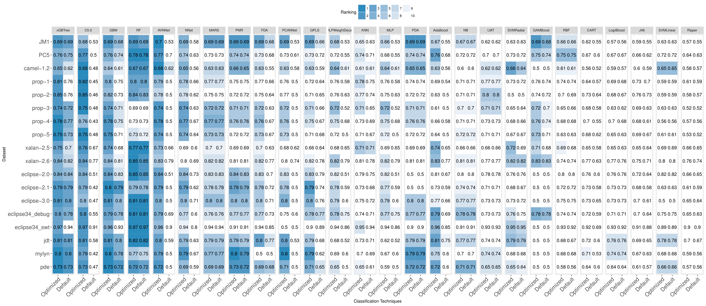

# Online Appendix for "The Impact of Automated Parameter Optimization on Defect Prediction Models"

[Under review]

## (1) Correlation analysis for the 18 studied datasets.

### JM1

### PC5

### Prop-1

### Prop-2

### Prop-3

### Prop-4

### Prop-5

### Camel 1.2

### Xalan 2.5

### Xalan 2.6

### Eclipse Platform 2.0

### Eclipse Platform 2.1

### Eclipse Platform 3.0

### Eclipse Debug 3.4

### Eclipse SWT 3.4

### Eclipse JDT

### Eclipse Mylyn

### Eclipse PDE

## (2) The AUC performance values of optimized-setting and default-setting models.

### The AUC performance of optimized models vs default-setting models

### The AUC performance of the ranking of the optimized models vs default-setting models

## (3) The ranking of classification technique for defect prediction models.

### AUC Measure

### MCC Measure

